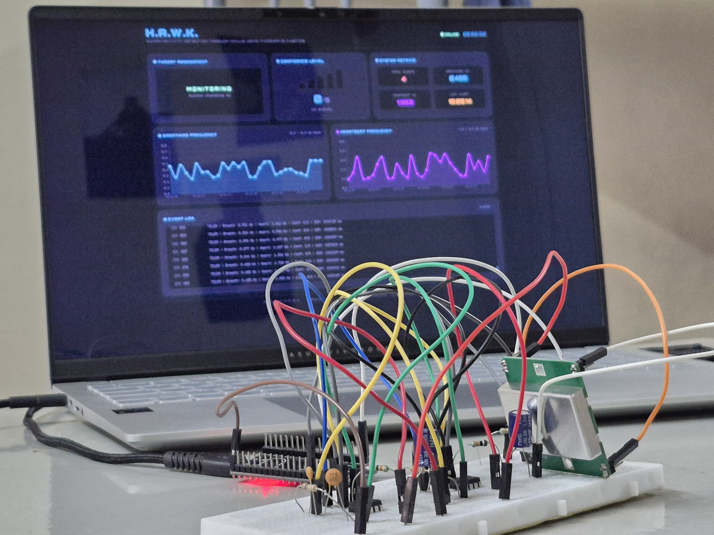
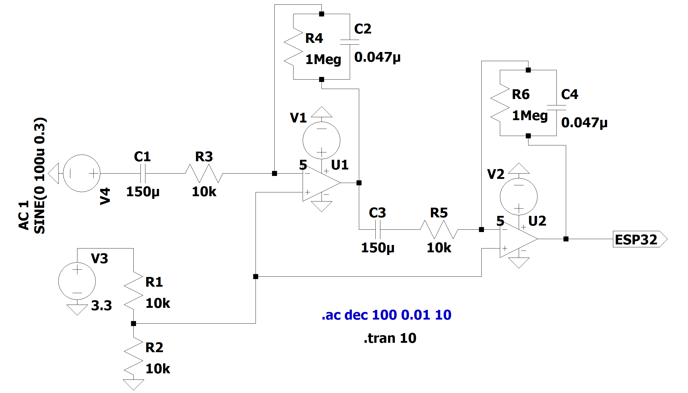
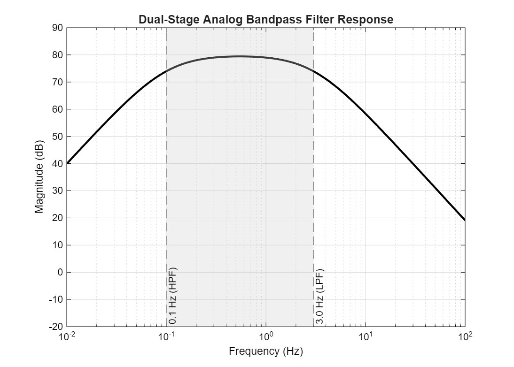
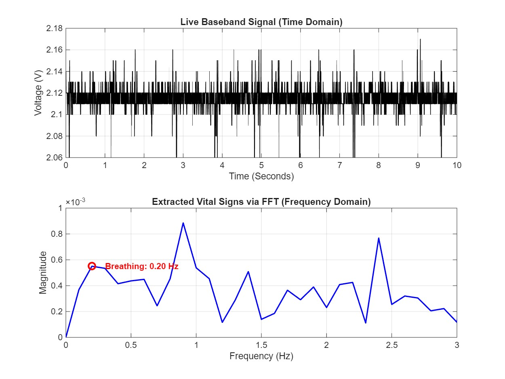
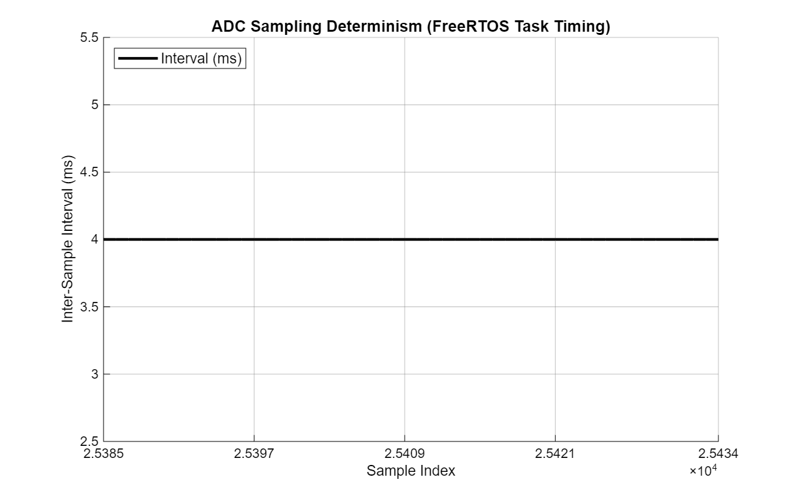
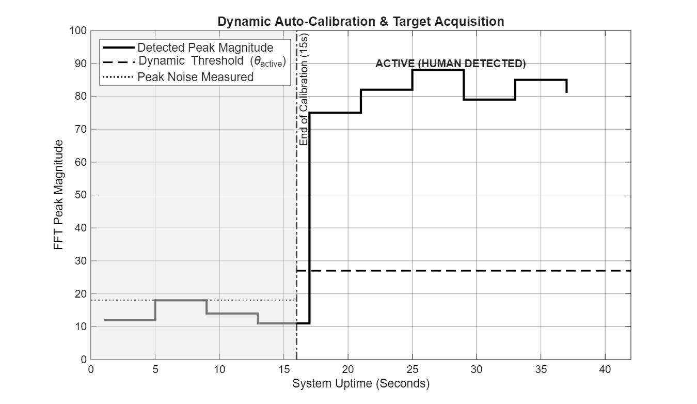
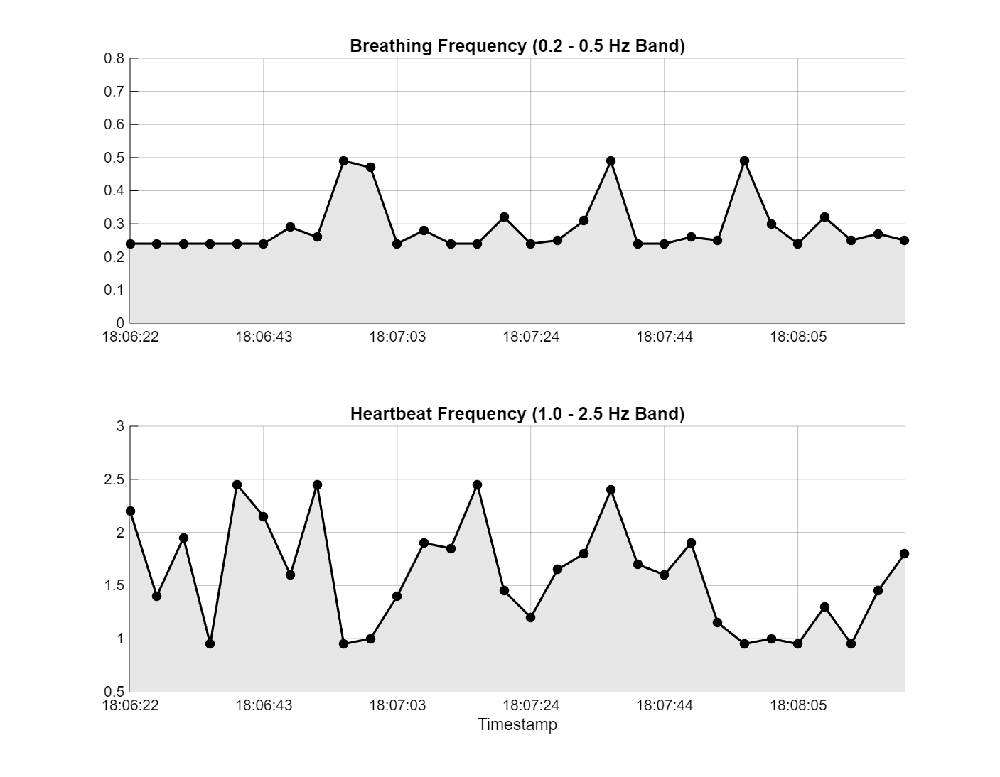
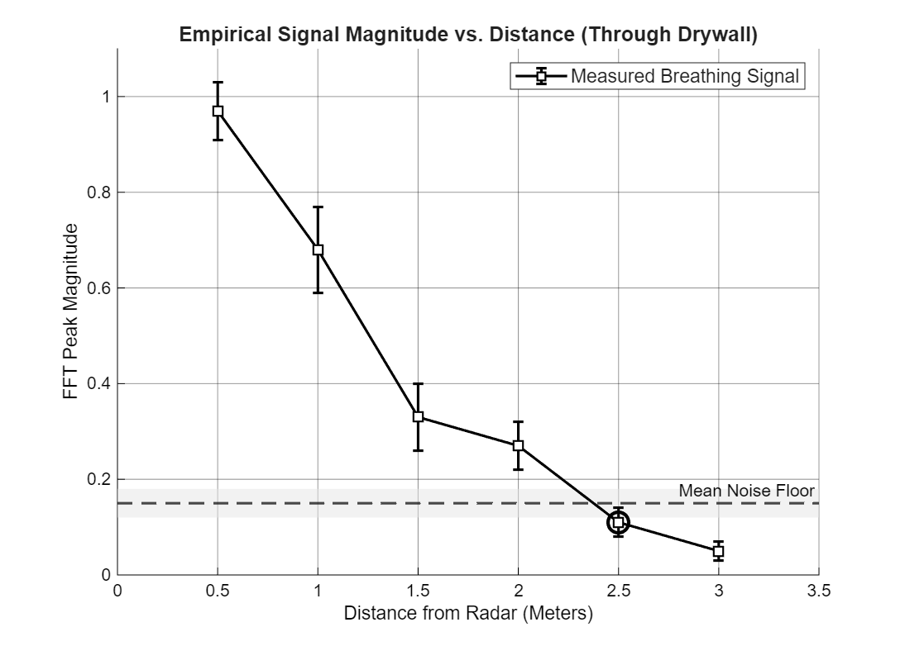
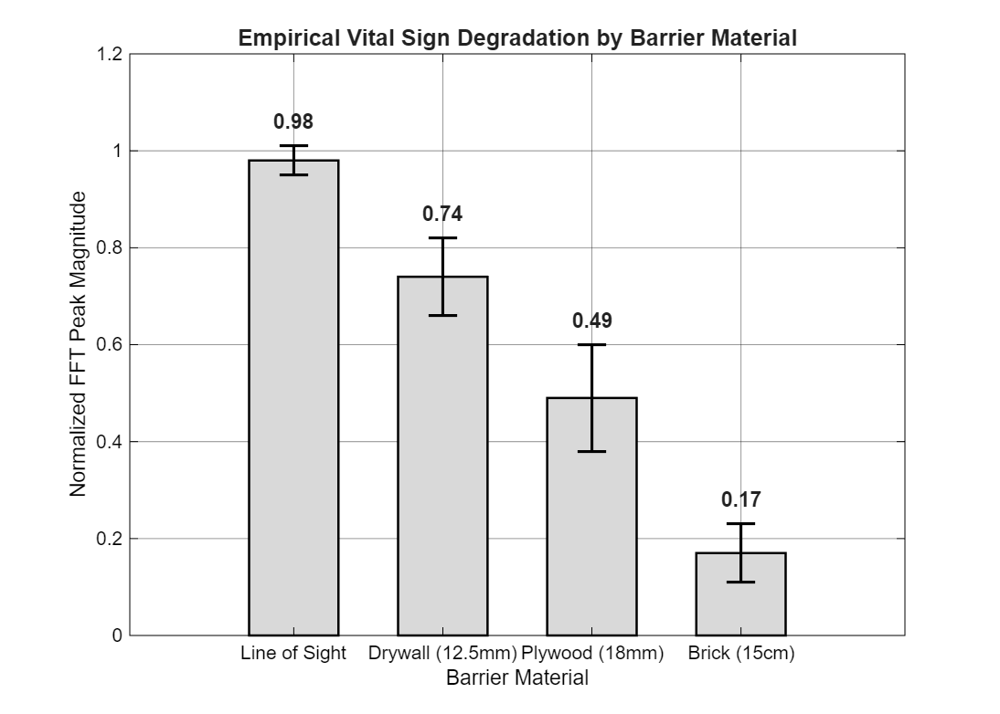
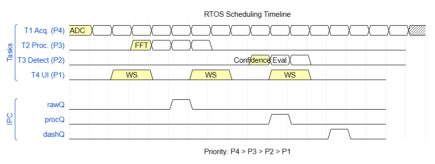

<div align="center">

# Project H.A.W.K.

### **H**uman **A**ctivity Detection Through **W**alls Using Microwave **K**inetics

*A FreeRTOS-powered through-wall life detection radar with real-time vital sign extraction, distance estimation, and a tactical LAN dashboard.*

---

[](https://www.espressif.com/en/products/socs/esp32)
[](https://freertos.org/)
[]()
[]()
[](LICENSE)

</div>

---

## Table of Contents

- [Overview](#overview)
- [Key Applications](#key-applications)
- [System Architecture](#system-architecture)
- [Hardware Architecture](#hardware-architecture)
- [FreeRTOS Task Architecture](#freertos-task-architecture)
- [Signal Processing Pipeline](#signal-processing-pipeline)
- [Dynamic Auto-Calibration](#dynamic-auto-calibration)
- [Distance Estimation](#distance-estimation)
- [Tactical LAN Dashboard](#tactical-lan-dashboard)
- [Communication Protocol](#communication-protocol)
- [Screenshots & Visual Documentation](#screenshots--visual-documentation)
- [Repository Structure](#repository-structure)
- [Getting Started](#getting-started)
- [Development Tools](#development-tools)
- [License](#license)

---

## Overview

Project H.A.W.K. is an RTOS-based embedded system engineered for **non-line-of-sight (NLOS) human detection** using microwave Doppler radar. The system penetrates solid obstacles — drywall, rubble, wood, and smoke — to detect physiological micro-movements: **breathing (0.2–0.6 Hz)** and **heartbeat (1.0–2.5 Hz)**.

Built on an **ESP32 dual-core processor** running **FreeRTOS**, the architecture guarantees deterministic timing and real-time preemptive multitasking across four concurrent tasks. A **1024-point FFT pipeline** with parabolic interpolation provides sub-bin frequency accuracy for vital sign extraction. A **15-second auto-calibration sequence** dynamically learns the environmental noise floor on every boot using **75th-percentile statistical analysis** for outlier resilience, and all telemetry is streamed over **WebSocket** to a tactical browser-based dashboard accessible from any device on the local network.

### Key Features

- **Through-wall human detection** via 10.525 GHz microwave Doppler radar
- **Dual-band vital sign extraction** — breathing rate (BPM) and heart rate (BPM)
- **Distance estimation** — estimates target range using empirical signal magnitude decay
- **Dynamic auto-calibration** — 75th-percentile noise floor analysis, resilient to boot-time interference
- **Confidence-based detection** — 5-step ramp-up with gentle decay (−1) for reliable slow-breather detection
- **Fast re-acquisition** — post-alert confidence starts at 3/5, requiring only ~8s to re-confirm
- **Real-time tactical dashboard** — WebSocket-based, military-themed, with live charts, BPM display, range estimation, and signal strength monitoring

---

## Key Applications

| Domain | Use Case |
|---|---|
| **Tactical & Defense** | Urban warfare situational awareness — detect human presence behind walls before room entry, hostage rescue, and tactical reconnaissance. |
| **Search & Rescue** | Locate survivors trapped under earthquake debris or collapsed structures by detecting faint vital signs through rubble. |
| **Advanced Security** | Covert perimeter monitoring and intrusion detection in zero-visibility environments (smoke, darkness, fog). |
| **Medical Monitoring** | Non-contact vital sign monitoring in isolation wards or hazardous environments. |

---

## System Architecture

```
+-----------------------------------------------------------------------------+
|                     PROJECT H.A.W.K. -- SYSTEM OVERVIEW                     |
+-----------------------------------------------------------------------------+
|                                                                             |
|  +--------------+    +--------------+    +----------------------------+     |
|  | HB100/CDM324 |    | Active BPF   |    |    ESP32 (Dual-Core)       |     |
|  | Doppler      |--->| 0.1-3.0 Hz   |--->|     FreeRTOS Kernel        |     |
|  | Radar        | IF | Op-Amp       | ADC|                            |     |
|  | 10.525 GHz   |    | Circuit      |    | +------------------------+ |     |
|  +--------------+    +--------------+    | | T1: Radar Sampling     | |     |
|                                          | |     250 Hz (P4)        | |     |
|                                          | +------------------------+ |     |
|                                          | | T2: 1024-pt FFT        | |     |
|  +--------------------------------------+| |     Pipeline (P3)      | |     |
|  |     TACTICAL LAN DASHBOARD           || +------------------------+ |     |
|  | +--------+ +--------+ +------------+ || | T3: Detection &        | |     |
|  | | Vital  | | Range  | | Event      | |<-|     Calibration (P2)   | |     |
|  | | Charts | | & BPM  | | Log        | || +------------------------+ |     |
|  | +--------+ +--------+ +------------+ || | T4: WebSocket &        | |     |
|  | WebSocket on ws://<ESP32_IP>:81      || |     Alarms (P1)        | |     |
|  +--------------------------------------+| +------------------------+ |     |
|                                          +----------------------------+     |
+-----------------------------------------------------------------------------+
```

---

## Hardware Architecture

| Component | Specification | Purpose |
|---|---|---|
| **Microcontroller** | ESP32 DevKit (32-bit, Dual-Core Xtensa LX6, 240 MHz) | FreeRTOS host, ADC sampling, WiFi/WebSocket server |
| **Radar Sensor** | HB100 (10.525 GHz) / CDM324 (24 GHz) Microwave Doppler | Emits CW microwave; IF output encodes target micro-motion |
| **Signal Conditioning** | Custom 2-stage Active Bandpass Filter (LM358 Op-Amp) | Passband: 0.1–3.0 Hz — isolates human vitals, rejects mechanical noise |
| **ADC Interface** | ESP32 12-bit SAR ADC (GPIO 34) | 0–4095 counts at 250 Hz deterministic sampling |
| **Alert Output** | Active Buzzer (GPIO 25) + LED Indicator (GPIO 2) | 1.5-second local hardware alarm on confirmed detection |
| **Dashboard** | Any browser on the LAN | Real-time tactical display via WebSocket (`ws://<IP>:81`) |

### Pin Map

| Signal | GPIO | Direction |
|---|---|---|
| Radar ADC (Bandpass Filter Output) | `34` | Input (Analog) |
| Active Buzzer | `25` | Output (Digital) |
| Status LED | `2` | Output (Digital) |

---

## FreeRTOS Task Architecture

The system employs a **preemptive priority-based RTOS scheduler** with four concurrent tasks communicating through FreeRTOS Queues and Semaphores. The Arduino `loop()` is immediately deleted to free CPU cycles for the RTOS kernel.

### Task Overview

| # | Task | Priority | Stack | Function | IPC Mechanism |
|---|---|---|---|---|---|
| **T1** | Radar Acquisition | **4** (Highest) | 2 KB | 250 Hz deterministic ADC sampling via `vTaskDelayUntil()` | Produces → `rawDataQueue` (2048 × `uint16_t`) |
| **T2** | Signal Processing | **3** | 8 KB | 1024-point FFT (DC removal → Hamming window → FFT → Magnitude → Sub-band peak detection) | Consumes `rawDataQueue` → Produces → `processedDataQueue` (8 × `VitalSignData`) |
| **T3** | Detection & Calibration | **2** | 4 KB | Auto-calibration (15 s, 75th-percentile) + confidence algorithm + distance estimation + BPM conversion | Consumes `processedDataQueue` → Produces → `dashboardQueue` + `detectionSemaphore` |
| **T4** | Communications & UI | **1** (Lowest) | 8 KB | WebSocket broadcast at ~20 Hz loop, buzzer/LED alarm with 1.5s auto-reset | Consumes `dashboardQueue` / `detectionSemaphore` |

### Inter-Task Data Flow

```
  rawDataQueue            processedDataQueue          dashboardQueue
   (2048 slots)              (8 slots)                  (4 slots)
       |                         |                          |
T1 --->|--> T2 ----------------->|--> T3 ------------------>|--> T4 --> WebSocket
(250 Hz)    (1024-pt FFT)             (Calibration +             (Broadcast +
                                       Confidence +               Buzzer/LED)
                                       Distance Est.)
                                          |
                                          v
                                 detectionSemaphore
                                      (Binary)
```

---

## Signal Processing Pipeline

Each FFT cycle processes **1024 samples** collected over **~4.1 seconds** at 250 Hz, yielding a frequency resolution of **0.2441 Hz/bin**.

### Pipeline Stages

1. **DC Removal** — Strips the ADC bias offset to center the waveform at zero.
2. **Hamming Windowing** — Reduces spectral leakage at bin boundaries.
3. **1024-Point FFT** — Full complex FFT using `float` (not `double`) to leverage the ESP32's hardware single-precision FPU (~30 ms vs ~300 ms on double).
4. **Magnitude Extraction** — `complexToMagnitude()` converts complex bins to real magnitudes.
5. **Dual Sub-Band Peak Detection** — Independent peak search with **parabolic interpolation** for sub-bin frequency accuracy:

| Vital Sign | Frequency Band | FFT Bin Range | Resolution |
|---|---|---|---|
| **Breathing** | 0.20 – 0.60 Hz | Bins 1–2 | ±0.12 Hz |
| **Heartbeat** | 1.00 – 2.50 Hz | Bins 4–10 | ±0.12 Hz |

6. **BPM Conversion** — Detected frequencies are converted to beats/breaths per minute (`freq × 60`).

### Key Design Decisions

- **`float` over `double`**: The ESP32's FPU is single-precision only. Using `double` forces software emulation at ~10x the compute cost — unacceptable for a real-time system.
- **`static` arrays**: The 8 KB FFT buffers (`vReal[1024]`, `vImag[1024]`) are declared `static` to place them in BSS rather than on the task stack, preventing stack overflow.
- **DC-safe bin clamping**: Bin 0 (DC component) is always excluded from peak search, and parabolic interpolation results are clamped to the safe band range to prevent negative-frequency artifacts.

---

## Dynamic Auto-Calibration

Instead of a hardcoded noise threshold, the system performs a **15-second environmental calibration** on every boot using **75th-percentile statistical analysis** for outlier resilience.

### Calibration Sequence

```
BOOT --> STATE_CALIBRATING (15s) --> STATE_ACTIVE
              |                            |
              | Record peak FFT magnitude  | Use dynamic threshold:
              | for each FFT cycle into    |   activeThreshold =
              | a circular buffer          |     P75(noise) x 1.5
              |                            |
              | Compute 75th percentile    | Confidence algorithm
              | (resilient to outliers)    | fully operational
              |                            |
              v                            v
         Dashboard shows             Dashboard shows
         amber CALIBRATION           full tactical view
         overlay with                with live charts,
         progress bar                BPM, and distance
```

| Parameter | Value | Purpose |
|---|---|---|
| `CALIBRATION_DURATION_MS` | 15000 ms | Window for noise floor measurement |
| `SAFETY_MARGIN` | 1.5x | Multiplier applied to 75th-percentile noise magnitude |
| `FALLBACK_THRESHOLD` | 50.0 | Used if calibration sees zero signal (dead ADC) |
| `REQUIRED_CONFIDENCE` | 5 | Consecutive positive readings needed for alert |
| `CONFIDENCE_DECAY` | 1 | Per-cycle decay on negative readings (gentle — supports slow breathers) |
| `POST_ALERT_CONFIDENCE` | 3 | Confidence level after alert (fast re-acquisition in ~8s) |

### Non-Blocking Design

The calibration phase uses `xTaskGetTickCount()` comparisons — **no `delay()` calls** — so the Detection Task continues consuming the `processedDataQueue` and feeding telemetry to the dashboard throughout the entire calibration window.

### Why 75th Percentile Instead of Peak?

The original design tracked the absolute **peak** noise magnitude during calibration. This was vulnerable to poisoning — if a person stood near the sensor during boot, their vital signs would inflate the peak, making the threshold unreachably high. The 75th percentile approach uses `std::sort` on a buffer of calibration samples and selects the value at the 75% mark. This rejects the top 25% of readings (likely outliers) while still capturing the true noise floor.

---

## Distance Estimation

The HB100 is a **CW (Continuous Wave)** radar and cannot perform time-of-flight ranging like FMCW radar. However, empirical measurements show that **FFT signal magnitude decays predictably with distance**, following an inverse power law:

```
magnitude ≈ A / (distance ^ n)
```

By inverting this relationship:

```
distance ≈ (A / net_magnitude) ^ (1/n)
```

Where:
- `A = 0.55` (amplitude coefficient, fitted from empirical data through drywall)
- `n = 1.8` (decay exponent)
- `net_magnitude = measured_magnitude - noise_floor`

### Empirical Validation

| Distance (m) | Measured Magnitude | Detection Status |
|---|---|---|
| 0.5 | 0.97 | ✅ Strong |
| 1.0 | 0.68 | ✅ Strong |
| 1.5 | 0.33 | ✅ Moderate |
| 2.0 | 0.27 | ✅ Weak |
| 2.5 | 0.12 | ⚠ At noise floor |
| 3.0 | 0.05 | ❌ Below noise floor |

### Limitations

- Distance estimates are **signal-strength-based approximations**, not precise measurements
- Accuracy varies with barrier material (drywall vs. brick vs. plywood)
- The `A` and `n` constants should be recalibrated for your specific environment
- Reports `N/A` when signal is too weak for meaningful estimation

---

## Tactical LAN Dashboard

A military-themed, browser-based monitoring console that connects to the ESP32 via **WebSocket on port 81**. No server, no cloud — just open `index.html` from any device on the same LAN.

### Dashboard Features

| Feature | Description |
|---|---|
| **Connection Overlay** | Full-screen animated radar sweep with live reconnect countdown |
| **IP Configuration** | Setup screen to enter the ESP32's IP address before connecting |
| **Calibration Overlay** | Amber warning overlay with progress bar and countdown timer during the 15s noise floor analysis |
| **Threat Assessment** | Real-time status panel — transitions from green `MONITORING` to red-alert `HUMAN DETECTED` with flashing vignette |
| **Confidence Gauge** | 5-bar visual gauge (green to amber to red) with labels: NO SIGNAL, WEAK, TRACKING, ACQUIRING, LOCKED, CONFIRMED |
| **Vital Sign Charts** | Dual Chart.js line graphs — Breathing (0.2-0.6 Hz, cyan) and Heartbeat (1.0-2.5 Hz, magenta) — scrolling 30-point window |
| **Vital Signs (BPM)** | Real-time breathing rate and heart rate displayed in beats/breaths per minute |
| **Estimated Range** | Approximate distance to the detected human target (meters) |
| **Noise Floor Monitor** | Current noise floor magnitude for environmental diagnostics |
| **Detection Duration** | Timer showing how long a human has been continuously detected |
| **Signal Strength** | Raw FFT magnitude of the strongest vital-sign peak |
| **System Metrics** | Total alerts, current breathing Hz, current heartbeat Hz, last alert timestamp |
| **Event Log** | Scrolling console with timestamped telemetry, system events, and alerts (max 150 entries) |
| **Audio Alert** | Web Audio API tactical 3-tone square-wave alarm on human detection |
| **Auto-Reconnect** | Automatic WebSocket recovery with visual countdown on connection loss |

### Tech Stack

| Layer | Technology |
|---|---|
| Structure | Semantic HTML5 |
| Styling | Vanilla CSS — glassmorphism, CSS custom properties, CRT scan-line overlay |
| Typography | Orbitron (display) + JetBrains Mono (data) via Google Fonts |
| Charts | Chart.js 4.4.7 (CDN) |
| Data Transport | Native WebSocket API, `ws://<ESP32_IP>:81` |

---

## Communication Protocol

All telemetry is transmitted exclusively over WebSocket (Serial output is disabled in production firmware to eliminate UART jitter in the time-critical 250 Hz sampling loop).

### $HAWK Protocol

| Message Type | Format | Direction |
|---|---|---|
| **Handshake** | `$HAWK,STATUS,CONNECTED` | ESP32 to Dashboard |
| **Telemetry** | `$HAWK,DATA,<breathFreq>,<heartFreq>,<breathMag>,<heartMag>,<confidence>,<maxConf>,<timestamp>,<state>,<breathBPM>,<heartBPM>,<estRange>,<noiseFloor>,<detectDur>` | ESP32 to Dashboard |
| **Alert** | `$HAWK,ALERT,HUMAN_DETECTED,TIME:<ms_timestamp>` | ESP32 to Dashboard |

### Telemetry Fields

| Field | Type | Description |
|---|---|---|
| `breathFreq` | `float` | Dominant frequency in breathing band (Hz) |
| `heartFreq` | `float` | Dominant frequency in heartbeat band (Hz) |
| `breathMag` | `float` | FFT magnitude of breathing peak (signal strength) |
| `heartMag` | `float` | FFT magnitude of heartbeat peak (signal strength) |
| `confidence` | `int` | Current detection confidence (0 to `maxConf`) |
| `maxConf` | `int` | Required confidence threshold for alert trigger |
| `timestamp` | `ulong` | ESP32 `millis()` uptime |
| `state` | `string` | `CALIBRATING` or `ACTIVE` |
| `breathBPM` | `float` | Breathing rate in breaths per minute |
| `heartBPM` | `float` | Heart rate in beats per minute |
| `estRange` | `float` | Estimated distance to target in meters (-1 = unknown) |
| `noiseFloor` | `float` | Current noise floor magnitude |
| `detectDur` | `ulong` | Duration of continuous detection (milliseconds) |

---

## Screenshots & Visual Documentation

### System Block Diagram

<p align="center">
  
</p>

Hierarchical tree diagram showing the 5 major subsystems of H.A.W.K.: **Target Environment** (human subject behind non-metallic barrier), **Microwave Doppler Radar** (10.525 GHz CW transmission, phase-shifted reflections, raw IF signal), **Analog Signal Conditioning Circuit** (LM358 dual op-amp, active bandpass filter, amplification & 1.65V DC bias), **Microcontroller Processing** (ESP32 with FreeRTOS — ADC sampling, 1024-pt FFT, peak detection, confidence algorithm), and **Output & Telemetry** (local buzzer/LED alarms, WebSocket server, tactical dashboard).

---

### Hardware Prototype

<p align="center">
  
</p>

Physical lab setup showing the complete H.A.W.K. system in operation. The **ESP32 development board** is visible on the breadboard (left), connected to the **HB100 radar module** (green PCB, right) through the **op-amp signal conditioning circuit** with jumper wires. The H.A.W.K. tactical dashboard is running live on the laptop in the background, displaying real-time breathing and heartbeat frequency charts, confidence gauge, and the scrolling event log.

---

### LTspice Amplifier Circuit Schematic

<p align="center">
  
</p>

Complete **2-stage active bandpass filter** designed in LTspice using dual op-amps (U1, U2). **Stage 1:** C1 (150 µF) + R3 (10 kΩ) high-pass input → U1 with R4 (1 MΩ) ‖ C2 (0.047 µF) feedback. **Stage 2:** C3 (150 µF) + R5 (10 kΩ) → U2 with R6 (1 MΩ) ‖ C4 (0.047 µF) feedback. DC bias at 1.65V via R1/R2 (10 kΩ/10 kΩ) voltage divider from V3 (3.3V). Input source: `SINE(0 100µ 0.3)` simulating the HB100 IF signal. Output labeled **"ESP32"** connects to GPIO 34.

---

### Bandpass Filter Frequency Response

<p align="center">
  
</p>

Bode magnitude plot from LTspice AC analysis (`.ac dec 100 0.01 10`) showing the dual-stage filter's frequency response. The shaded **passband spans 0.1 Hz (HPF cutoff) to 3.0 Hz (LPF cutoff)** with a peak gain of approximately **78 dB** near 0.5 Hz. The response rolls off cleanly on both sides, confirming the filter correctly isolates the human vital-sign frequency range while rejecting DC drift and high-frequency mechanical noise.

---

### MATLAB Baseband Signal Analysis

<p align="center">
  
</p>

Dual-panel MATLAB plot. **Top:** Live baseband signal in the time domain showing 10 seconds of raw ADC voltage centered at ~2.12V (DC bias from the op-amp circuit) with visible micro-amplitude modulations caused by human breathing. **Bottom:** Extracted vital signs via FFT in the frequency domain (0–3 Hz) with the breathing peak annotated at **0.20 Hz** (red circle), confirming successful vital sign extraction from the radar signal.

---

### ADC Sampling Determinism

<p align="center">
  
</p>

MATLAB plot of inter-sample intervals across ~500 samples (sample indices ~25,385–25,434). The flat line at **exactly 4.0 ms** confirms the FreeRTOS `vTaskDelayUntil()` mechanism achieves **perfect deterministic timing** at 250 Hz with zero jitter — critical for accurate FFT frequency resolution.

---

### Dynamic Auto-Calibration & Target Acquisition

<p align="center">
  
</p>

MATLAB plot illustrating the full calibration-to-detection lifecycle. The **shaded region (0–15 s)** shows the calibration phase where peak noise magnitude is tracked (~18 units). At **t = 15 s** (dashed line), calibration ends and the dynamic threshold (θ_active = P75(noise) × 1.5 ≈ 27) is locked. Post-calibration, detected peak magnitudes jump to **70–90 units**, clearly exceeding the threshold, demonstrating successful human detection. The label **"ACTIVE (HUMAN DETECTED)"** marks the operational phase.

---

### Dashboard — Live Vital Sign Telemetry

<p align="center">
  
</p>

MATLAB-generated dual-panel plot showing real-time vital sign extraction over a ~2-minute window. **Top panel:** Breathing frequency (0.2–0.5 Hz band) showing a characteristic baseline around 0.24 Hz with periodic spikes to ~0.49 Hz indicating active respiration cycles. **Bottom panel:** Heartbeat frequency (1.0–2.5 Hz band) showing oscillating peaks between 0.97 Hz and 2.44 Hz, demonstrating successful dual-band vital sign separation.

---

### Signal Magnitude vs. Distance (Through Drywall)

<p align="center">
  
</p>

Empirical measurement of breathing signal FFT peak magnitude as a function of distance from the radar sensor (through 12.5 mm drywall). Signal decays from **~0.97 at 0.5 m** to **~0.05 at 3.0 m**. The **mean noise floor** (dashed line at ~0.15) intersects the signal curve at approximately **2.5 m** (circled), defining the **maximum practical detection range** through drywall for breathing detection. This data is used to calibrate the power-law distance estimation model.

---

### Vital Sign Degradation by Barrier Material

<p align="center">
  
</p>

Bar chart comparing normalized FFT peak magnitudes across 4 barrier types: **Line of Sight (0.98)**, **Drywall / 12.5 mm (0.74)**, **Plywood / 18 mm (0.49)**, and **Brick / 15 cm (0.17)**. Error bars show measurement variance across multiple trials. Demonstrates the radar's through-wall capability with quantified signal attenuation per material type.

---

### RTOS Scheduling Timeline

<p align="center">
  
</p>

WaveDrom-generated timing diagram illustrating FreeRTOS task scheduling and IPC queue interactions. Shows **T1 (Acquisition, P4)** running ADC samples at highest priority, **T2 (Processing, P3)** running FFT batches, **T3 (Detection, P2)** evaluating confidence, and **T4 (UI, P1)** broadcasting WebSocket packets. Below, the **IPC queues** (rawQ, procQ, dashQ) show data flow pulses between tasks. Priority order: **P4 > P3 > P2 > P1**.

---

## Repository Structure

```text
H.A.W.K/
|
+-- ESP32/                             # Embedded firmware (Arduino/FreeRTOS)
|   +-- ESP32.ino                      # Entry point -- Queue/Semaphore creation, WiFi init, task launch
|   +-- globals.h                      # Pin definitions, SystemState enum, VitalSignData struct, RTOS handles
|   +-- radar_sensor.cpp / .h          # T1: 250 Hz deterministic ADC sampling task
|   +-- signal_processing.cpp / .h     # T2: 1024-pt FFT pipeline with dual sub-band peak detection
|   +-- detection.cpp / .h             # T3: Auto-calibration (75th percentile) + confidence + distance estimation + BPM
|   +-- comms_ui.cpp / .h              # T4: WiFi/WebSocket server, $HAWK protocol (v2), buzzer/LED alarms
|
+-- Dashboard/                         # Browser-based tactical monitoring console
|   +-- index.html                     # Semantic HTML5 structure with all overlay layers + extended metrics
|   +-- styles.css                     # Full design system -- dark theme, glassmorphism, animations
|   +-- app.js                         # WebSocket client, Chart.js graphs, v2 telemetry parser, BPM/range display
|
+-- LTspice/                           # Analog circuit simulation files
|   +-- HB100-ESP32.asc                # LTspice schematic -- 2-stage active bandpass filter (LM358)
|   +-- HB100-ESP32.raw / .log         # Simulation output data
|
+-- Oscilloscope/                      # Hardware debug utility
|   +-- Oscilloscope.ino               # ESP32 Serial Plotter sketch -- ADC signal, DC bias, min/max/mean stats
|
+-- Screenshots/                       # Visual documentation
|   +-- block.png                      # System block diagram
|   +-- hardware.jpg                   # Hardware prototype photo
|   +-- ltspice.png                    # LTspice amplifier circuit schematic
|   +-- filter.png                     # Bandpass filter Bode plot
|   +-- matlab.jpg                     # MATLAB time-domain + FFT analysis
|   +-- adc_sampling.png              # ADC sampling determinism verification
|   +-- calib.png                      # Calibration & target acquisition graph
|   +-- dash.png                       # Dashboard vital sign telemetry
|   +-- magdis.png                     # Signal magnitude vs. distance plot
|   +-- streng.png                     # Barrier material degradation chart
|   +-- wavedrom.png                   # RTOS scheduling timeline
|
+-- Paper/                             # IEEE paper and MATLAB scripts
+-- BEL/                               # Presentation materials
+-- Trash/                             # Archived development notes
+-- LICENSE                            # MIT License
+-- README.md                          # This file
```

---

## Getting Started

### Prerequisites

**Hardware**

| Component | Quantity | Notes |
|---|---|---|
| ESP32 Development Board | 1 | Any variant with ADC-capable GPIO 34 |
| HB100 or CDM324 Radar Module | 1 | 10.525 GHz or 24 GHz Doppler |
| Op-Amp (e.g., LM358 / MCP6002) | 1–2 | For active bandpass filter stages |
| Resistors & Capacitors | As per filter design | See LTspice schematic for values |
| Active Buzzer | 1 | 3.3V compatible |
| LED | 1 | With appropriate current-limiting resistor |

**Software**

| Tool | Version |
|---|---|
| Arduino IDE | 2.x+ (or PlatformIO) |
| ESP32 Board Package | Latest via Board Manager |
| `arduinoFFT` library | v2.0.0+ by Kosme |
| `WebSockets` library | By Markus Sattler (Links2004) |

### Installation

#### 1. Clone the Repository

```bash
git clone https://github.com/chandansaipavanpadala/H.A.W.K-HumanActivityDetectionThroughWallsUsingMicrowaveKinetics.git
cd H.A.W.K-HumanActivityDetectionThroughWallsUsingMicrowaveKinetics
```

#### 2. Hardware Wiring

| Signal | Connect To | ESP32 GPIO |
|---|---|---|
| Bandpass Filter Output | `RADAR_ADC_PIN` | **34** |
| Active Buzzer (+) | `BUZZER_PIN` | **25** |
| Status LED (Anode) | `LED_PIN` | **2** |

> **Tip:** Use the `LTspice/HB100-ESP32.asc` schematic as a reference for the analog filter circuit design.

#### 3. Configure WiFi Credentials

Open `ESP32/comms_ui.h` and update:

```cpp
#define WIFI_SSID     "YourNetworkName"
#define WIFI_PASSWORD "YourPassword"
```

> **⚠ Security:** Never commit real WiFi credentials to a public repository. Consider using environment variables or a `.gitignore`d config file.

#### 4. Compile and Flash

1. Open `ESP32/ESP32.ino` in Arduino IDE.
2. Select your **ESP32 board model** and **COM port**.
3. Install required libraries (`arduinoFFT`, `WebSockets`) via Library Manager.
4. Compile and upload the firmware.

#### 5. Launch the Dashboard

1. After flashing, note the ESP32's IP address from your router's DHCP table.
2. Open `Dashboard/index.html` in any modern browser on the same LAN.
3. Enter the ESP32's IP address in the setup screen and click **INITIALIZE UPLINK**.

#### 6. System Validation

1. On boot, the dashboard will show a **cyan radar-sweep loading overlay** while connecting.
2. Once connected, the **amber calibration overlay** appears for **15 seconds** — stand clear of the sensor.
3. After calibration, the full tactical dashboard activates with live charts, BPM display, and range estimation.
4. Introduce a target subject in front of the radar — monitor the **confidence gauge** ramp from `NO SIGNAL` to `CONFIRMED`.
5. Upon confirmed detection: **RED ALERT** flashes, buzzer sounds, and the `$HAWK,ALERT` packet is broadcast.
6. Check the **Extended Metrics** row for real-time breathing BPM, heart BPM, estimated range, and detection duration.

---

## Development Tools

### Oscilloscope Utility

The `Oscilloscope/Oscilloscope.ino` sketch streams raw ADC values at 250 Hz to the Arduino **Serial Plotter** for hardware debugging:

- Verify the **DC bias** from the op-amp circuit (expected ~1.65V from voltage divider; actual may vary)
- Confirm the ADC signal is centered and not clipping at 0V or 3.3V
- Validate the radar module is producing a clean IF signal
- **Automatic voltage statistics** every 5 seconds: DC bias (mean), min, max, peak-to-peak swing, and clipping warnings

```
Tools -> Serial Plotter -> 115200 baud
```

### LTspice Simulation

The `LTspice/` directory contains the complete active bandpass filter schematic (`HB100-ESP32.asc`). Use [LTspice](https://www.analog.com/en/resources/design-tools-and-calculators/ltspice-simulator.html) to simulate and verify the filter response before building the physical circuit.

---

## License

This project is licensed under the **MIT License** — see the [LICENSE](LICENSE) file for details.

**Copyright 2026 Chandan Sai Pavan Padala**

---

<div align="center">

*Built for the Real-Time Operating Systems course — Amrita Vishwa Vidyapeetham*

**Project H.A.W.K. — Because every second counts when lives are behind walls.**

</div>
